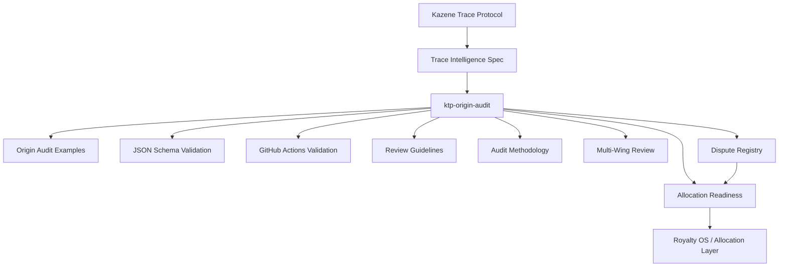
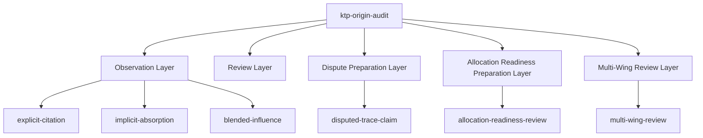
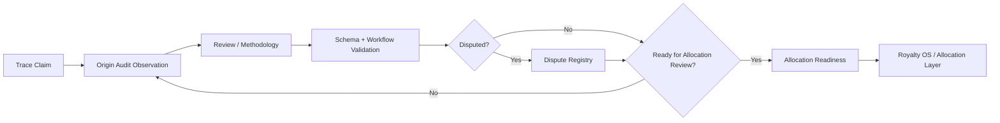
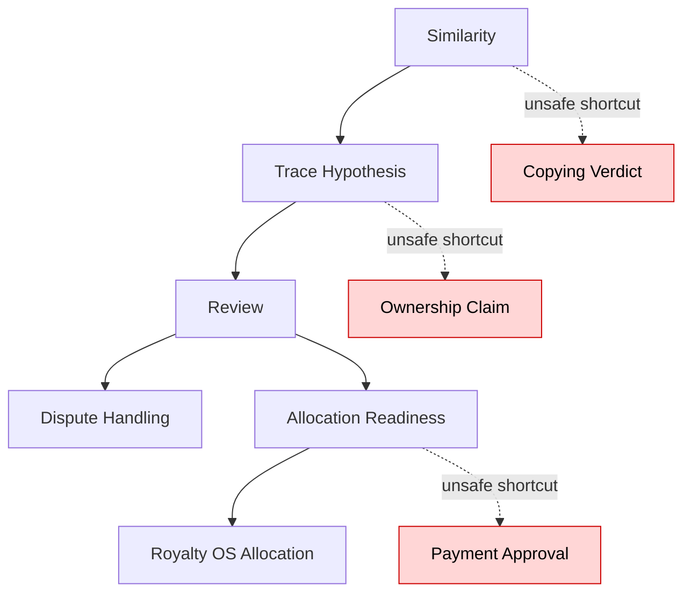
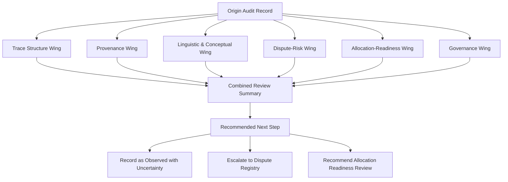

# Architecture Overview

## Purpose

This document provides a high-level architecture overview of `ktp-origin-audit` within the Kazene Trace Protocol ecosystem.

`ktp-origin-audit` is a pre-judicial origin audit layer.  
It observes trace claims, preserves uncertainty, supports review, and prepares records for downstream governance without issuing verdicts or approving allocation.

In short:

```text
Origin Audit sits between trace specification and downstream governance.
```

---

## Core Architecture



---

## Layer Meaning

### Kazene Trace Protocol

The broader ecosystem for trace-related structures, claims, review processes, and governance boundaries.

### Trace Intelligence Spec

The structural language for describing trace relationships.

It defines how trace claims can be represented.

### ktp-origin-audit

The applied pre-judicial layer.

It turns trace structures into reviewable examples, validation rules, methodology, governance boundaries, and Multi-Wing Review examples.

### Dispute Registry

The downstream layer for managing formally contested trace claims.

### Allocation Readiness

The downstream layer for checking whether a trace claim is prepared for allocation review.

### Royalty OS / Allocation Layer

The downstream layer where allocation decisions may eventually occur.

Origin Audit does not perform this role.

---

## Internal Structure



---

## Example Flow



---

## Governance Boundary

Origin Audit must preserve the following boundary:

```text
Origin Audit observes.
Dispute Registry manages disputes.
Allocation Readiness checks readiness.
Royalty OS performs allocation.
```

Origin Audit must not collapse into downstream authority.

It may prepare records for downstream review, but it must not issue judgments, resolve disputes, determine ownership, or approve allocation.

---

## Safety Constraints

Every valid Origin Audit record should preserve:

```json
{
  "not_a_verdict": true,
  "not_legal_advice": true,
  "not_ownership_determination": true,
  "not_royalty_allocation": true
}
```

These constraints protect the repository from being misused as:

- a court
- a copyright ruling system
- a plagiarism detector
- an ownership registry
- a royalty allocation engine

---

## Anti-Collapse Model



The purpose of Origin Audit is to prevent unsafe shortcuts such as:

```text
similarity → copying
trace → ownership
readiness → payment approval
```

---

## Multi-Wing Review Position



Multi-Wing Review improves audit quality by preserving multiple perspectives.

It does not create final authority.

Recommended principle:

```text
Many wings may see more clearly,
but even many wings must not pretend to be the judge.
```

---

## Repository Role

`ktp-origin-audit` provides:

- validated audit examples
- Multi-Wing Review example support
- JSON Schema validation
- GitHub Actions validation
- review guidelines
- audit methodology
- relationship documents
- v1.0 graduation criteria

It does not provide:

- legal judgment
- ownership determination
- plagiarism ruling
- dispute resolution
- royalty allocation

---

## Summary

`ktp-origin-audit` sits between trace specification and downstream governance.

Its role is to slow down unsafe judgment, organize evidence, preserve uncertainty, and prepare trace claims for responsible review.

Final boundary:

```text
Trace is not ownership.
Review is not verdict.
Readiness is not approval.
Audit is not allocation.
```
